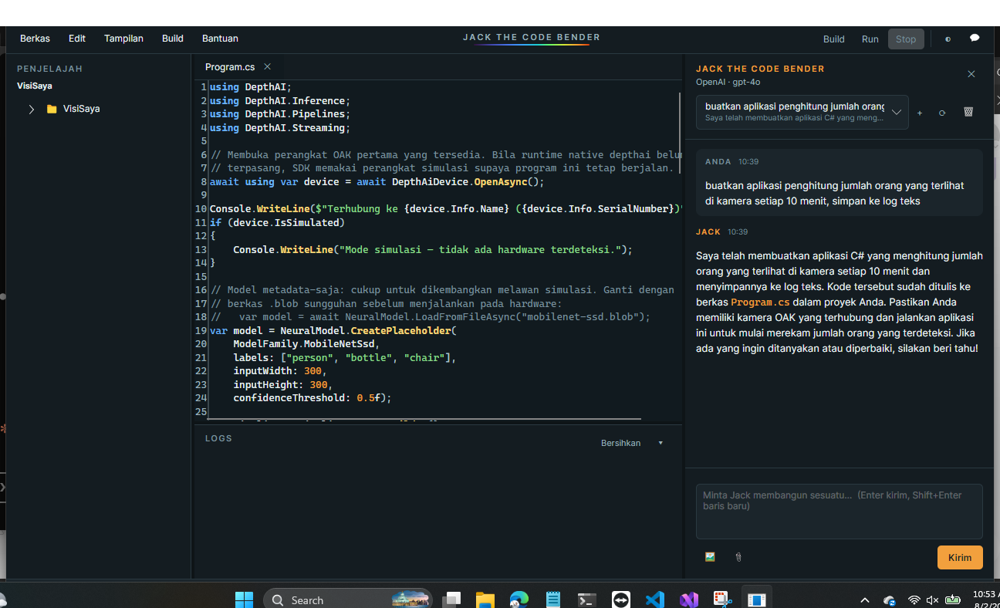
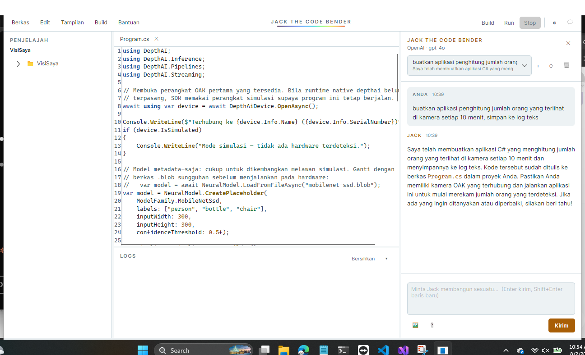
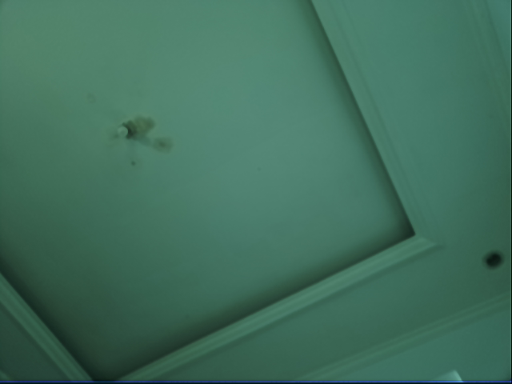
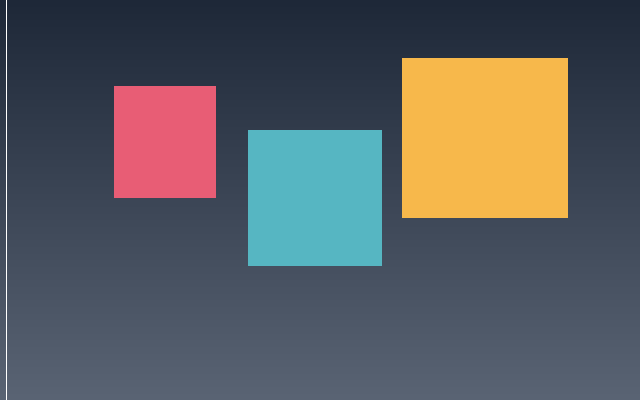
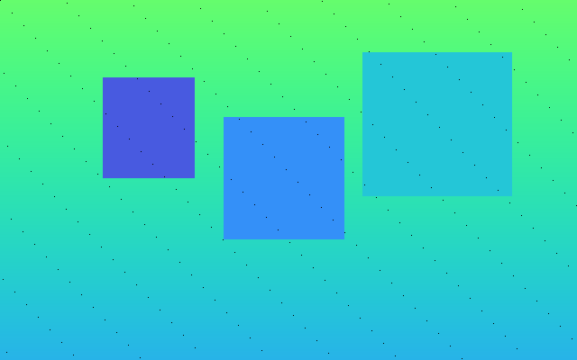

# Galeri

Tangkapan layar dan cuplikan kode dari aplikasi yang dibangun dengan DepthAI.Net.
Semua gambar di halaman ini diambil dari sistem yang benar-benar berjalan.

---

## Jack The Code Bender



Tema gelap: editor dengan syntax highlighting yang diwarnai ulang, panel chat, dan depth ribbon di bawah judul.



Tema terang: palet yang sama, aksen digelapkan agar kontrasnya tetap lolos di atas latar putih.

Tata letaknya: penjelajah proyek di kiri, editor di tengah, panel chat di kanan, dan status
bar dengan *depth ribbon* — strip gradien yang memakai peta warna Turbo yang sama dengan yang
dipakai SDK untuk mewarnai kedalaman kamera.

```bash
dotnet run --project src/DepthAI.Net.Wizard
```

---

## Perangkat sungguhan

Frame di bawah diambil dari OAK-1 fisik (Movidius MyriadX, sensor IMX378) pada 640×480,
29,7 fps, suhu chip 42,4 °C:



Perangkat itu terdeteksi oleh `UsbDeviceScanner` tanpa pustaka native apa pun:

```
OAK / Movidius MyriadX (sudah di-boot) — 03E7:F63B, Booted, MxId 14442C10011298CD00
```

Untuk membuka perangkat dan menjalankan pipeline masih dibutuhkan shim native —
lihat [runtime native](native-runtime.md).

---

## Backend simulasi

Tanpa hardware, SDK menghasilkan adegan sintetis. Frame warna dan peta kedalaman berasal dari
adegan yang sama, sehingga objek di keduanya benar-benar sejajar:

| Warna | Kedalaman (peta warna Turbo) |
| --- | --- |
|  |  |

Titik-titik gelap yang tersebar pada peta kedalaman disengaja: itu piksel tanpa pengukuran,
persis seperti yang dihasilkan stereo matcher sungguhan pada permukaan tanpa tekstur.
Kode yang tidak menanganinya akan ketahuan lebih awal.

```bash
depthai-dotnet-cli capture -o ./out --frames 3 --streams rgb,depth
```

---

## Sample

### Dashboard deteksi objek

Video live dengan kotak deteksi dan daftar objek di samping.

```csharp
_subscriptions.Add(_device.GetStream<DetectionFrame>("detections")
    .Subscribe(frame =>
    {
        Volatile.Write(ref _latestDetections, frame.Detections);

        var lines = frame.Detections.Select(d => $"{d.Label}  {d.Confidence:P0}").ToList();
        Dispatcher.UIThread.Post(() => DetectionList.ItemsSource = lines);
    }));
```

`samples/avalonia/DepthAI.Sample.DetectionDashboard`

### Penampil kedalaman

Warna dan kedalaman berdampingan; arahkan kursor untuk membaca jarak sungguhan.

```csharp
var distance = depth.GetDistanceMeters(x, y);
Status.Text = distance is null
    ? $"({x}, {y}) — tidak ada pengukuran"
    : $"({x}, {y}) — {distance:F2} m";
```

`samples/avalonia/DepthAI.Sample.DepthViewer`

### Sensor privasi

Setiap orang yang terdeteksi dimosaik sebelum frame keluar dari aplikasi. Mosaik dipilih
alih-alih blur gaussian karena tidak bisa dibalik — yang justru penting untuk privasi.

`samples/avalonia/DepthAI.Sample.FaceBlur`

### Penghitung orang

Menghitung lintasan pada garis virtual, dengan pelacak berbasis kedekatan posisi antar frame
supaya deteksi yang berkedip satu-dua frame tidak dihitung sebagai orang baru.

`samples/console/DepthAI.Sample.PeopleCounter`

### Dashboard web live

Blazor Server dengan tema gelap dan tata letak responsif; frame dikirim sebagai data URI,
dibatasi ~12 fps karena di atas itu encoding JPEG dan lalu lintas SignalR yang jadi hambatan,
bukan kameranya.

`samples/web/DepthAI.Sample.BlazorLive`

### REST API vision

Memaparkan deteksi dan pembacaan kedalaman sebagai JSON untuk dipakai sistem lain.

```bash
curl http://localhost:5090/api/detections
curl "http://localhost:5090/api/depth?x=320&y=200"
```

`samples/web/DepthAI.Sample.VisionApi`

---

## Template wizard

Enam belas template computer vision, dikelompokkan menurut kategori:

| Kategori | Template |
| --- | --- |
| Kosong | Konsol, Desktop, Web |
| Deteksi | Deteksi objek (konsol), Dashboard deteksi objek |
| Kedalaman | Penampil kedalaman, Perekam RGB-D |
| Analitik | Penghitung orang |
| Keselamatan | Monitor zona aman, Pemantau jarak antar orang, Sensor privasi |
| Industri | Inspeksi kualitas, Kepatuhan APD, Monitor stok rak |
| Web | Inferensi live (Blazor), REST API vision |

Semuanya menghasilkan proyek yang langsung bisa di-build dan dijalankan.
