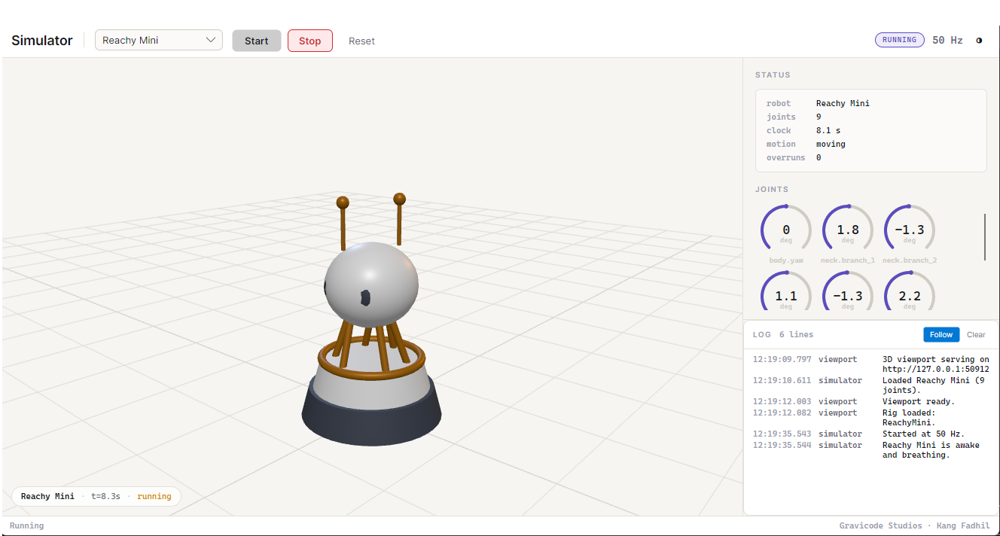
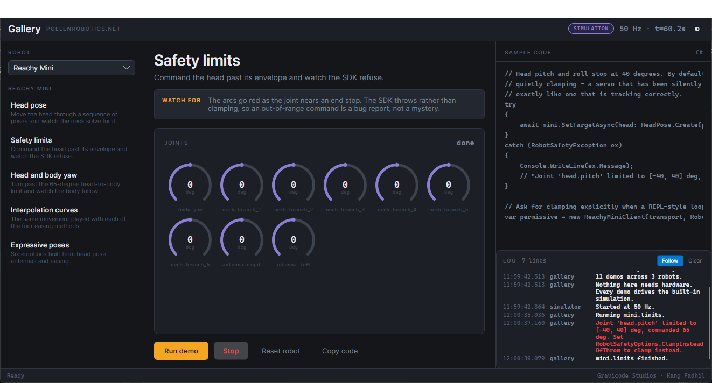
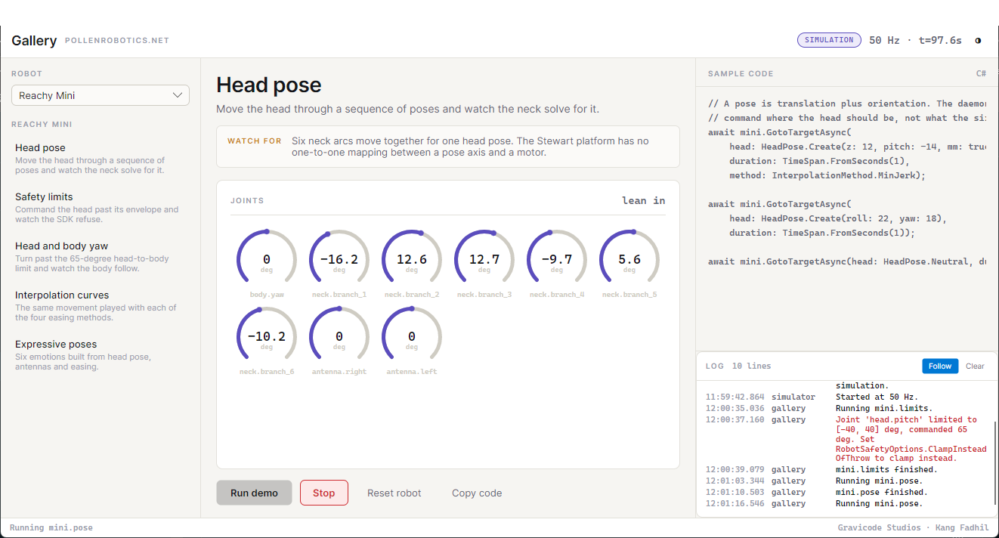
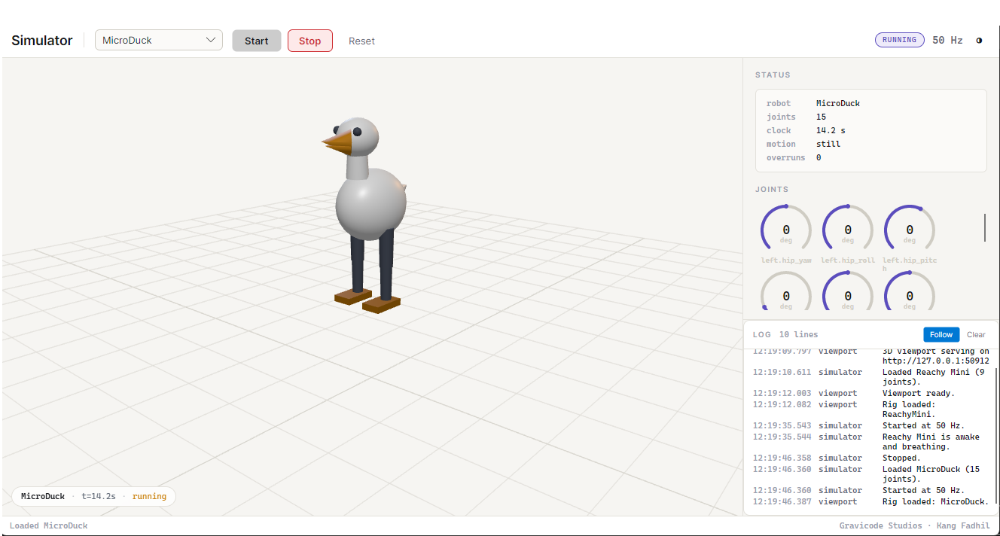
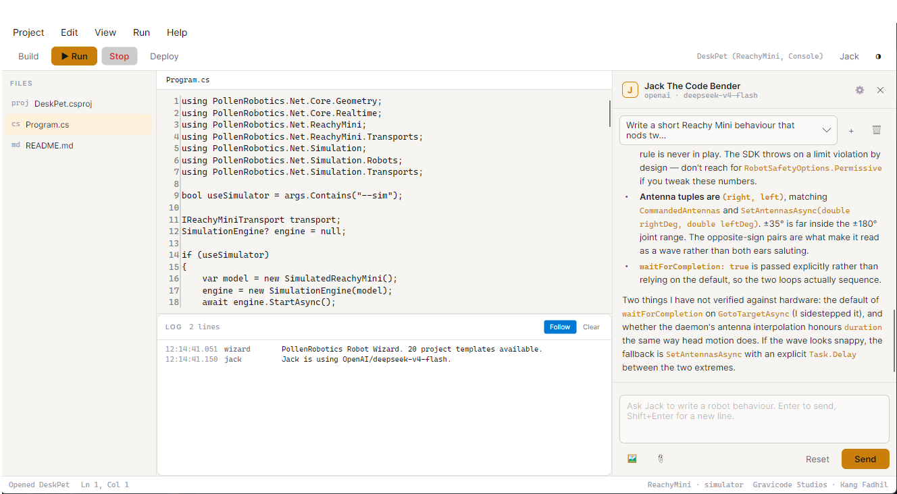
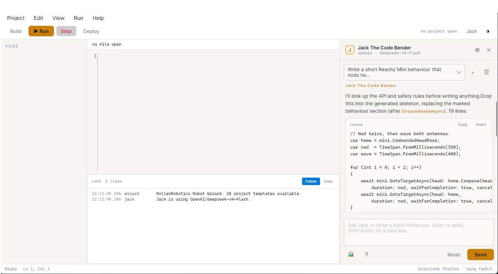

# PollenRobotics.Net

**An unofficial .NET 10 SDK for Pollen Robotics hardware — Reachy Mini, MicroDuck and Reachy 2 —
with a gallery, a 3D simulator and an LLM-assisted code editor.**

Built by **Gravicode Studios**, led by **Kang Fadhil**.

> *[Bahasa Indonesia di bawah](#bahasa-indonesia) — versi lengkap.*

---

Everything here runs without a robot. The simulator is not a stub bolted on afterwards: the SDK
talks to a transport interface, and the in-process simulation implements the same interface the
daemon does, so a behaviour written against one runs unchanged against the other.



*The simulator: Avalonia shell, three.js viewport, live joint instrumentation. The six struts are
the neck's real parallel mechanism, solved every frame.*

---

## What is in the box

| | |
|---|---|
| **SDK** | Three robot clients, kinematics, transports, safety limits |
| **Simulator** | Avalonia + Blazor + three.js, all three robots, 50 Hz |
| **Gallery** | Eleven runnable demos with their source beside them |
| **Robot Wizard** | Code editor with Jack The Code Bender, twenty project templates |
| **CLI** | `pollen doctor`, `pollen joints`, `pollen new`, `pollen sim`, … |

```
src/
  PollenRobotics.Net.Core          poses, joints, safety, the realtime loop
  PollenRobotics.Net.Kinematics    Stewart platform, 7-axis arms, damped least squares IK
  PollenRobotics.Net.Transport     line-delimited JSON-RPC, WebSocket, HTTP
  PollenRobotics.Net.ReachyMini    daemon REST + WebSocket client
  PollenRobotics.Net.MicroDuck     robotd JSON-RPC client
  PollenRobotics.Net.Reachy2       gRPC client on Pollen's own reachy2-sdk-api protos
  PollenRobotics.Net.Simulation    kinematic models + in-process transports
  PollenRobotics.Net.Ml            ONNX policy runner, ML.NET gesture classifier
  PollenRobotics.Net.Ai            Semantic Kernel: OpenAI, Anthropic, Gemini, Ollama
  PollenRobotics.Net.Ui            the Avalonia design system
  PollenRobotics.Net.Wizard.Core   project model, template catalogue, build pipeline
apps/     Gallery · Simulator · Wizard · Cli
samples/  DeskCompanion — the worked example the templates are distilled from
tools/    TemplateCheck — scaffolds and compiles every template
tests/    37 tests, xunit.v3
docs/     guides, plus the screenshots above in docs/images/
```

## Getting started

```bash
dotnet build PollenRobotics.Net.slnx
dotnet run --project tests/PollenRobotics.Net.Tests

# Nothing below needs a robot.
dotnet run --project apps/PollenRobotics.Net.Gallery
dotnet run --project apps/PollenRobotics.Net.Simulator
dotnet run --project apps/PollenRobotics.Net.Wizard
dotnet run --project samples/PollenRobotics.Net.Samples.DeskCompanion -- --sim
```

`dotnet test` will not work here: this is an xUnit v3 project and the .NET 10 SDK no longer bridges
it through VSTest. The test project is an executable - run it.

The CLI is the quickest way in:

```bash
cd apps/PollenRobotics.Net.Cli

dotnet run -- doctor                  # is a robot reachable, and if not, why
dotnet run -- joints reachy-mini      # the joint model with limits
dotnet run -- templates               # the twenty project templates
dotnet run -- new mini.hello DeskPet  # scaffold one
dotnet run -- mini dance --sim        # drive the simulator
```

## Your first behaviour

```csharp
using PollenRobotics.Net.Core.Geometry;
using PollenRobotics.Net.ReachyMini;
using PollenRobotics.Net.ReachyMini.Transports;
using PollenRobotics.Net.Simulation.Transports;

// The only line that decides whether this drives hardware or the simulator.
IReachyMiniTransport transport = useSimulator
    ? new SimulatedReachyMiniTransport()
    : new ReachyMiniDaemonTransport(ReachyMiniOptions.Default);

await using var mini = new ReachyMiniClient(transport, ownsTransport: true);

await mini.ConnectAsync();
await mini.EnsureAwakeAsync();

await mini.GotoTargetAsync(
    head: HeadPose.Create(z: 12, pitch: -8, mm: true),
    antennas: (45.Degrees(), (-45).Degrees()),
    duration: TimeSpan.FromSeconds(1.5));

await mini.GotoSleepAsync();
```

## The gallery

Eleven demos, each one running against the simulation through the same client classes an
application would use. The code panel is the code that is executing.



*Commanding 65 degrees of head pitch against a 40-degree limit. The SDK throws; the exception is in
the log, in red, with the fix in the message.*



*The same tool in light theme, mid-movement. Six neck arcs move together for one head pose — a
Stewart platform has no one-to-one mapping between a pose axis and a motor.*

## The simulator

An Avalonia shell around a Blazor page that renders the robot with three.js. Both halves live in one
process and share one `SimulationEngine`, so the 3D and the status panel read the same snapshot.



*MicroDuck under its gait model. The camera follows a robot that travels; the joint arcs show the
legs half a cycle apart.*


*Reachy 2: two seven-axis arms, an Orbita neck, grippers and the mobile base. Twenty-one joints.*

## The Robot Wizard

A code editor for robot applications, with **Jack The Code Bender** in a panel beside it.



*A project scaffolded from the Idle Life template, opened in the editor. Build, Run and Deploy sit
on the toolbar; the log below carries build errors, robot telemetry and Jack's own output in one
stream.*



*Jack writing a behaviour. He looked the API up with the SDK reference functions before answering —
`CommandedHeadPose`, `GotoTargetAsync`, `waitForCompletion` are all real members of this SDK, not
recalled from something else.*

Jack runs on Semantic Kernel and speaks to **OpenAI, Anthropic, Gemini or Ollama** (and anything
OpenAI-compatible, through the endpoint override). His persona, model, temperature and function
access live in `appsettings.json`, so they can be retuned without a rebuild.

He can call:

- the SDK reference — list types, describe a type, search members, read a robot's joint limits
- code generation — project files, program skeletons, the safety rules for a robot
- the web — Tavily search, page reading, file-from-URL
- the ordinary things models are bad at — arithmetic, unit conversion, today's date

## Safety

The SDK **throws** on a limit violation rather than clamping.

```
Joint 'head.pitch' limited to [-40, 40] deg, commanded 65 deg.
Set RobotSafetyOptions.ClampInsteadOfThrow to clamp instead.
```

The Python SDK clamps silently, which is friendly in a REPL and dangerous in a control loop: a servo
that has been quietly clamped for ten minutes looks exactly like one that is tracking correctly.
Clamping is still available — you just have to ask for it.

## Status

The SDK builds clean and 40 tests pass. **Nothing has been run against physical hardware.** Read
[PROGRESS.md](PROGRESS.md) before relying on any of it on a robot — it separates what is verified
from what is written against published documentation.

### Packages

Eleven packages, published on nuget.org at 0.1.1:

```bash
dotnet add package Gravicode.PollenRobotics.Net.ReachyMini
dotnet add package Gravicode.PollenRobotics.Net.Simulation
```

The version is 0.x deliberately. It reaches 1.0 when a real robot has answered.

**The prefix is on the package ID only.** Namespaces are unprefixed, so the code stays
`using PollenRobotics.Net.ReachyMini;` everywhere. See [docs/publishing.md](docs/publishing.md).

## Documentation

| | |
|---|---|
| [PLAN.md](PLAN.md) | Roadmap |
| [PROGRESS.md](PROGRESS.md) | What works, what is unverified |
| [docs/architecture.md](docs/architecture.md) | How the layers fit together |
| [docs/getting-started.md](docs/getting-started.md) | Install, connect, first behaviour |
| [docs/reachy-mini.md](docs/reachy-mini.md) | Poses, antennas, the yaw constraint |
| [docs/microduck.md](docs/microduck.md) | Velocity intents, action slots, falls |
| [docs/reachy2.md](docs/reachy2.md) | Parts, the movement queue, IK |
| [docs/kinematics.md](docs/kinematics.md) | What is exact and what is approximate |
| [docs/joint-models.md](docs/joint-models.md) | Every joint limit and where it came from |
| [docs/simulator.md](docs/simulator.md) | Architecture and the 3D rigs |
| [docs/wizard.md](docs/wizard.md) | Templates, build/run/deploy, Jack |
| [docs/safety.md](docs/safety.md) | Limits and how they are enforced |
| [docs/publishing.md](docs/publishing.md) | Package IDs, versioning, pushing to NuGet |

## Licence

MIT. The `.proto` files under `src/PollenRobotics.Net.Reachy2/Protos/` are Pollen Robotics' own,
vendored verbatim from `reachy2-sdk-api` under Apache 2.0.

This project is not affiliated with or endorsed by Pollen Robotics.

---

<a name="bahasa-indonesia"></a>

# PollenRobotics.Net — Bahasa Indonesia

**SDK .NET 10 tidak resmi untuk perangkat keras Pollen Robotics — Reachy Mini, MicroDuck, dan
Reachy 2 — lengkap dengan galeri, simulator 3D, dan editor kode berbantuan LLM.**

Dibuat oleh **Gravicode Studios**, dipimpin **Kang Fadhil**.

Semua yang ada di sini bisa dijalankan tanpa robot. Simulatornya bukan tempelan: SDK berbicara ke
sebuah antarmuka transport, dan simulasi in-process mengimplementasikan antarmuka yang sama seperti
daemon. Jadi perilaku yang ditulis untuk salah satunya berjalan apa adanya di keduanya.

## Isi paket

| | |
|---|---|
| **SDK** | Tiga klien robot, kinematika, transport, batas keselamatan |
| **Simulator** | Avalonia + Blazor + three.js, tiga robot, 50 Hz |
| **Galeri** | Sebelas demo siap jalan dengan kode sumbernya |
| **Robot Wizard** | Editor kode dengan Jack The Code Bender, dua puluh templat proyek |
| **CLI** | `pollen doctor`, `pollen joints`, `pollen new`, `pollen sim`, … |

## Mulai cepat

```bash
dotnet build PollenRobotics.Net.slnx
dotnet run --project tests/PollenRobotics.Net.Tests

# Semuanya di bawah ini tidak butuh robot.
dotnet run --project apps/PollenRobotics.Net.Gallery
dotnet run --project apps/PollenRobotics.Net.Simulator
dotnet run --project apps/PollenRobotics.Net.Wizard
```

Lewat CLI:

```bash
cd apps/PollenRobotics.Net.Cli

dotnet run -- doctor                  # apakah robot terjangkau, kalau tidak kenapa
dotnet run -- joints reachy-mini      # model sendi beserta batasnya
dotnet run -- templates               # dua puluh templat proyek
dotnet run -- new mini.hello DeskPet  # buat proyek baru
dotnet run -- mini dance --sim        # jalankan di simulator
```

## Perilaku pertama Anda

```csharp
// Satu-satunya baris yang menentukan ini menggerakkan robot atau simulator.
IReachyMiniTransport transport = useSimulator
    ? new SimulatedReachyMiniTransport()
    : new ReachyMiniDaemonTransport(ReachyMiniOptions.Default);

await using var mini = new ReachyMiniClient(transport, ownsTransport: true);

await mini.ConnectAsync();
await mini.EnsureAwakeAsync();

await mini.GotoTargetAsync(
    head: HeadPose.Create(z: 12, pitch: -8, mm: true),
    antennas: (45.Degrees(), (-45).Degrees()),
    duration: TimeSpan.FromSeconds(1.5));

await mini.GotoSleepAsync();
```

## Galeri

Sebelas demo, masing-masing berjalan di simulasi lewat kelas klien yang sama seperti yang dipakai
aplikasi sungguhan. Panel kode di sebelah kanan adalah kode yang sedang berjalan.


*Memerintahkan pitch kepala 65 derajat terhadap batas 40 derajat. SDK melempar exception; pesannya
muncul merah di log, lengkap dengan cara memperbaikinya.*


*Alat yang sama dengan tema terang, di tengah gerakan. Enam busur leher bergerak bersama untuk satu
pose kepala — platform Stewart tidak punya pemetaan satu-ke-satu antara sumbu pose dan motor.*

## Simulator

Shell Avalonia yang membungkus halaman Blazor dan merender robot dengan three.js. Keduanya hidup di
satu proses dan berbagi satu `SimulationEngine`.


*MicroDuck dengan model gait-nya. Kamera mengikuti robot yang berpindah; busur sendi menunjukkan
kedua kaki berselisih setengah siklus.*


*Reachy 2: dua lengan tujuh sumbu, leher Orbita, gripper, dan mobile base. Dua puluh satu sendi.*

## Robot Wizard

Editor kode untuk aplikasi robot, dengan **Jack The Code Bender** di panel sebelahnya.


*Proyek hasil templat Idle Life, terbuka di editor. Build, Run, dan Deploy ada di toolbar; log di
bawah membawa error build, telemetri robot, dan keluaran Jack dalam satu aliran.*


*Jack menulis sebuah perilaku. Ia mencari API lewat fungsi referensi SDK sebelum menjawab —
`CommandedHeadPose`, `GotoTargetAsync`, `waitForCompletion` semuanya anggota nyata SDK ini, bukan
hasil mengingat SDK lain.*

Jack berjalan di atas Semantic Kernel dan mendukung **OpenAI, Anthropic, Gemini, atau Ollama** (dan
apa pun yang kompatibel OpenAI, lewat override endpoint). Persona, model, temperature, dan akses
fungsinya disimpan di `appsettings.json`, jadi bisa diubah tanpa build ulang.

Fungsi yang bisa ia panggil:

- referensi SDK — daftar tipe, uraikan tipe, cari anggota, baca batas sendi robot
- pembuatan kode — file proyek, kerangka program, aturan keselamatan tiap robot
- web — pencarian Tavily, pembacaan halaman, baca berkas dari URL
- hal yang model biasanya lemah — aritmetika, konversi satuan, tanggal hari ini

## Keselamatan

SDK ini **melempar exception** saat batas dilanggar, bukan diam-diam menjepit nilai.

```
Joint 'head.pitch' limited to [-40, 40] deg, commanded 65 deg.
Set RobotSafetyOptions.ClampInsteadOfThrow to clamp instead.
```

SDK Python menjepit tanpa memberi tahu. Itu ramah untuk REPL dan berbahaya untuk control loop:
servo yang sudah sepuluh menit dijepit diam-diam terlihat persis seperti servo yang bekerja normal.
Penjepitan tetap tersedia — Anda hanya perlu memintanya secara eksplisit.

## Status

SDK ini build bersih dan 40 test lulus. **Belum pernah dijalankan pada perangkat keras sungguhan.**
Baca [PROGRESS.md](PROGRESS.md) sebelum mengandalkannya di robot — di sana dipisahkan mana yang sudah
terverifikasi dan mana yang ditulis berdasarkan dokumentasi publik.

### Paket

Sebelas paket, sudah terbit di nuget.org pada versi 0.1.1:

```bash
dotnet add package Gravicode.PollenRobotics.Net.ReachyMini
dotnet add package Gravicode.PollenRobotics.Net.Simulation
```

Versinya sengaja 0.x. Angka 1.0 baru pantas setelah ada robot sungguhan yang menjawab.

**Prefix hanya melekat pada ID paket.** Namespace tetap tanpa prefix, jadi kode Anda tetap menulis
`using PollenRobotics.Net.ReachyMini;`. Prosedur lengkapnya ada di
[docs/publishing.md](docs/publishing.md).

## Lisensi

MIT. Berkas `.proto` di `src/PollenRobotics.Net.Reachy2/Protos/` adalah milik Pollen Robotics,
disalin apa adanya dari `reachy2-sdk-api` di bawah Apache 2.0.

Proyek ini tidak berafiliasi dengan dan tidak didukung secara resmi oleh Pollen Robotics.
