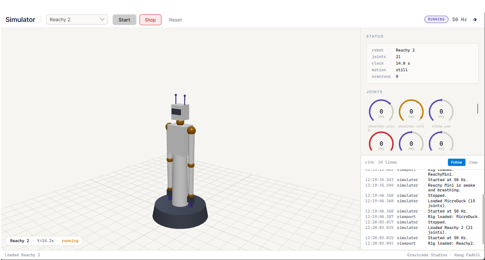

# Reachy 2

Two seven-axis arms, a three-axis Orbita neck, two antennas, two parallel grippers, and an optional
omnidirectional mobile base. Twenty-one joints.



## Wire contract

This is the one robot whose wire format is not guesswork: the `.proto` files under
`src/PollenRobotics.Net.Reachy2/Protos/` are Pollen's own, vendored verbatim from `reachy2-sdk-api`
under Apache 2.0. `tools/sync-protos.ps1` refreshes them.

## The things that will bite you

**Movements queue per part.** A goto returns as soon as it is accepted and the motion happens later.
"The call returned" says nothing about where the arm is.

```csharp
Reachy2GotoHandle move = await arm.GotoJointsAsync(joints, TimeSpan.FromSeconds(2));
GotoOutcome outcome = await move.WaitAsync();   // this is what waits
```

**Seed inverse kinematics with the arm's present position.** Seeding from zero gives a
geometrically valid solution reached by an unacceptable route - the elbow flips through the torso on
the way there.

**Keep `IKContinuousMode.Continuous` along a trajectory.** Switching to discrete mid-path is how an
arm reaches every waypoint correctly while flipping its elbow between them.

**Parts are discovered at connect time.** Check for null; not every robot has a mobile base.

**Turning off makes everything compliant.** The arms sag and anything a gripper is holding drops.

## Connecting

```csharp
await using var reachy = Reachy2Client.Connect(Reachy2Options.ForHost("reachy.local"));
await reachy.ConnectAsync();
await reachy.TurnOnAsync();

Console.WriteLine($"{reachy.RobotName}, hardware {reachy.Info?.VersionHard}");
```

`TurnOnAsync` energises the arms before the grippers. A gripper energised on a compliant arm can
swing the whole limb by its own reaction torque.

## Arms

```csharp
if (reachy.RightArm is not { } arm) return;

// Joint space. Order: shoulder pitch, shoulder roll, elbow yaw, elbow pitch,
// wrist roll, wrist pitch, wrist yaw - radians.
await (await arm.GotoJointsAsync([-1.2, -0.4, 0, -1.1, 0, 0.2, 0], TimeSpan.FromSeconds(2)))
    .WaitAsync();

// Cartesian, solved by the robot against its true model.
await (await arm.GotoPoseAsync(pose, TimeSpan.FromSeconds(2))).WaitAsync();

// Streaming a trajectory computed elsewhere: bypasses the queue, newest target wins.
await arm.SetPoseAsync(pose);
```

`IKConstrainedMode.LowElbow` keeps the elbow down, which is what you want for anything happening on
a table in front of the robot.

### Reachability

```csharp
if (!await arm.IsReachableAsync(pose))
{
    // The robot's own solver says no. That is a real answer, not an estimate.
}
```

Prefer this over the local `arm.Chain`, whose link lengths are approximate. See
[kinematics.md](kinematics.md).

### Both arms

```csharp
// Queue both, then wait for both. Awaiting the first before queueing the second makes the arms
// take turns instead of moving together.
Reachy2GotoHandle right = await reachy.RightArm!.GotoJointsAsync(rightGoal, duration);
Reachy2GotoHandle left = await reachy.LeftArm!.GotoJointsAsync(leftGoal, duration);

await Task.WhenAll(right.WaitAsync(), left.WaitAsync());
```

Shoulder roll is the axis that mirrors between sides - its limits are mirror images, so the same
value on both arms sends one of them straight into a limit.

## Head

The neck is an Orbita3d: one spherical actuator, not three stacked servos. It is commanded as an
orientation.

```csharp
await (await reachy.Head!.GotoRpyDegreesAsync(0, -10, 25, TimeSpan.FromSeconds(1))).WaitAsync();
await (await reachy.Head.LookAtAsync(1.2, 0.0, 0.3, TimeSpan.FromSeconds(1.5))).WaitAsync();

(Angle roll, Angle pitch, Angle yaw) = await reachy.Head.GetOrientationAsync();
```

Comparing `GetOrientationAsync` against `GetGoalOrientationAsync` is how you tell "has not moved
yet" from "moved and stopped short" - they look identical from either reading alone.

## Grippers

```csharp
await reachy.RightGripper!.OpenAsync();
await reachy.RightGripper.CloseAsync();
await reachy.RightGripper.SetOpeningAsync(percent: 40);

if (!await reachy.RightGripper.IsHoldingAsync())
{
    // Closed on nothing. Carrying on wastes the rest of the routine and looks, from across the
    // room, exactly like a successful pick.
}
```

Read through `GetStateAsync`, not the `GetForce` RPC - that RPC exists in the API but its `Force`
message is still empty upstream.

## Mobile base

Holonomic: it translates in any direction while rotating independently.

```csharp
if (reachy.MobileBase is not { } mobileBase) return;

await mobileBase.TurnOnAsync();
await mobileBase.SetDriveModeAsync(ZuuuModePossiblities.CmdGoto);
await mobileBase.ResetOdometryAsync();

await mobileBase.GotoAsync(1.0, 0.5, 90.Degrees());

if (!await mobileBase.WaitForArrivalAsync(0.08, TimeSpan.FromSeconds(45)))
{
    await mobileBase.BrakeAsync();   // something is in the way
}
```

The drive mode matters. A velocity command sent while the base is braked is accepted and does
nothing.

| Mode | Behaviour |
|---|---|
| `CmdVel` / `Speed` | Tracks velocity commands |
| `CmdGoto` / `GoTo` | Drives to a pose |
| `Brake` | Holds position against a push |
| `FreeWheel` | Can be pushed by hand |
| `EmergencyStop` | Cuts drive |

Unlike the MicroDuck, `SetSpeedAsync` takes its duration on the command itself, so there is no need
to keep resending and no risk of the base running on if the caller dies.

## Streaming state

```csharp
await foreach (ReachyState state in reachy.StreamStateAsync(cancellationToken))
{
    // Keep this cheap. A slow consumer applies backpressure to the whole channel.
}
```

Preferred over polling for anything mirroring the robot in real time.

## No simulation transport

Reachy Mini and MicroDuck have in-process simulation transports; Reachy 2 does not, because its
client talks to Pollen's generated gRPC stubs rather than to an interface of ours. Its templates
therefore have no `--sim` switch - point them at `localhost` running Pollen's own simulation stack.
Closing that gap is on the [roadmap](../PLAN.md).
