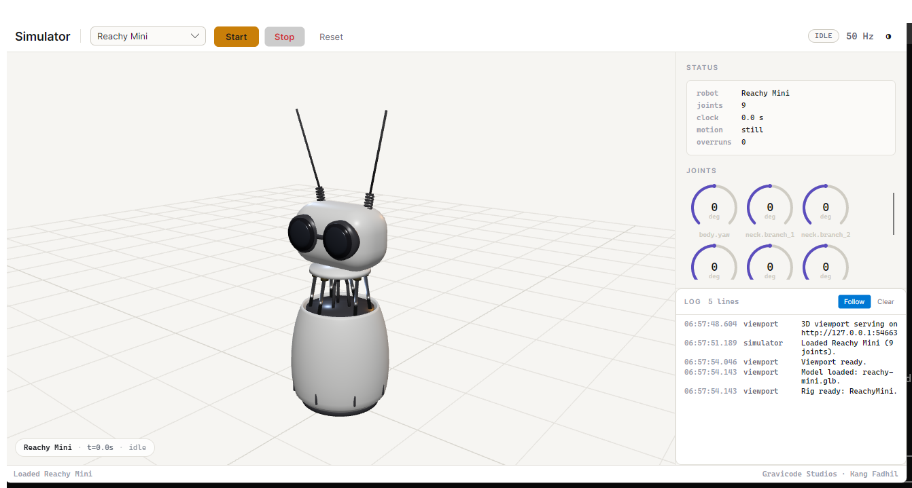
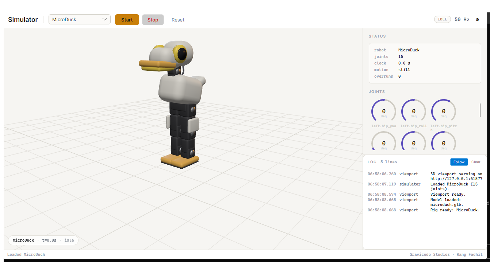

# The simulator



An Avalonia shell around a Blazor page that renders the robot with three.js. Robot picker, Start and
Stop, a status panel, live joint instrumentation and the log.

```bash
dotnet run --project apps/PollenRobotics.Net.Simulator
```

## Why two frameworks

The 3D belongs in a browser engine - three.js is mature, WebGL is everywhere, and writing a
scene graph against Avalonia's drawing API would be reinventing it badly. Everything else belongs in
Avalonia: a combo box and a status table are things it does better than HTML, and the controls have
to stay responsive even when the viewport is not.

So the process starts Kestrel on loopback, serves one Blazor page, and shows it in the window.

**Both halves share one `SimulationEngine` instance.** The viewport reads the same snapshots the
status panel does - no serialisation between them, no second copy of the robot to keep in step.

```
Program.Main
  |
  +-- ViewportHost.StartAsync  -> Kestrel on 127.0.0.1:<ephemeral>
  |                               Blazor Server, one page, InteractiveServer
  |
  +-- Avalonia desktop lifetime
        MainWindow
          EmbeddedBrowser -> WebView2 -> the page above
          status / joints / log panels
```

Kestrel starts first and on a background thread, then the main thread goes to Avalonia. Both
frameworks want to own the process lifetime; `StartWithClassicDesktopLifetime` blocks until the
window closes, so anything started after it never runs.

## The viewport

Loopback only, on an ephemeral port. Binding to a fixed port would collide with a second copy of the
simulator; binding to anything but loopback would put a robot viewport on the network without anyone
asking.

On Windows with the WebView2 runtime the page is hosted inside the window. Everywhere else it opens
in the default browser - and that is a real path, not an apology: the viewport is a web page served
over loopback, and a browser renders it identically.

Joint frames are pushed from C# at 30 Hz over the Blazor circuit. That is a timer sampling
`LatestSnapshot`, not a subscription to `FrameProduced` - the engine ticks at 50 Hz on its own
thread, and marshalling every one of those onto the circuit would queue frames faster than they
drain.

## The 3D models

Each robot is a glTF model generated by [`tools/blender`](../tools/blender/README.md) from the
photographs in `images/`, loaded with `GLTFLoader` and articulated by node name.

They replaced hand-built primitive rigs. The primitives were a deliberate compromise - Pollen
publishes no meshes under a licence this project could vendor - but a sphere with a flat disc stuck
to the front is not a Reachy Mini, and a simulator people look at all day should look like the robot
on the desk. Modelling them here keeps the licence position intact: these are our own meshes, built
from photographs.

| Robot | What carries the likeness |
|---|---|
| Reachy Mini | An open bowl body with all six steel neck struts exposed on brass fittings, a rounded slab head with two large lenses joined by a bridge, and a spring at the base of each antenna |
| MicroDuck | A helmet head carried well forward, one huge bezelled eye per side, a broad flat bill, pastel shells over a bare black servo spine, and feet far larger than the legs need |
| Reachy 2 | The navy Breton stripes - separate rings, not a texture - white limb shells over silver actuator barrels, raked ball-tipped antennas, and a round mobile base |

Reachy Mini's neck struts are the detail worth pointing at: each one is stretched and aimed between
its base and platform anchor every frame, from the solved branch angles, so the parallel mechanism
visibly behaves like a parallel mechanism. Nothing covers them, because nothing covers them on the
robot either: `images/reachy_mini3.jpg` shows a part-assembled Mini with six bare rods rising out of
an open bowl. An earlier version of this model put a grey fabric cuff in the gap, which was wrong
twice over - the robot has no such part, and it hid the one mechanism this simulator exists to
show.

### Articulation is by name

Every joint is an empty named for its SDK joint, so applying a frame is a lookup and a rotation:

```js
nodes.get('r_arm.elbow.pitch').rotation.x = joints[3];
```

Nothing is addressed by index. If a model and the viewport drift apart, `requireNodes` names the
joints it could not find and tells you to rebuild, rather than posing three-quarters of a robot and
leaving the rest frozen.

Node names lose their dots on the way through glTF - three.js strips `. : / [ ]` from every name as
it loads - so both sides substitute underscores. That substitution lives in one function on each
side, and the first load of these models failed precisely because only one side had it.

### Colours are the robots' own

The models keep the colours they are painted, and the theme changes the ground, the grid and the
lighting instead. Re-tinting the robot per theme was only ever a way of keeping primitives readable;
a white shell, a navy striped shirt and an orange beak are what these machines look like in both.

### Reference frames

The rigs are authored directly in three.js space (y up), so a joint angle maps straight onto the
axis its name claims. The only place the two conventions meet is where a world pose is applied - the
duck's body - and that conversion is written out once, there. Converting per joint is how a rig ends
up with one axis inverted and nobody able to say which.

### The camera follows

A robot that travels leaves a fixed frame within seconds, which reads as the viewport having
stopped working. The camera target eases toward the rig's position so you can still orbit while it
follows.

## Things that were silent

Three failures during development presented as a blank canvas with no error anywhere. All three are
now reported into the log panel, and the mechanism that does it is worth knowing about.

**`OutputType=WinExe` on a Web SDK project drops the framework's static web assets.** wwwroot still
serves, `_framework/blazor.web.js` 404s, and the page renders as a static prerender where no event
handler and no `OnAfterRenderAsync` ever runs. The project is `Exe` and hides its own console.

**`@rendermode` on `RouteView` makes the framework serialise `RouteData`**, which carries a
`System.Type`. The page returns HTTP 500. The render mode goes on the page component.

**`MapStaticAssets`, not `UseStaticFiles`.** The framework's own files come from the static web
assets endpoint manifest, not from wwwroot. And `UseStaticWebAssets()` has to be called explicitly,
because ASP.NET Core only does it automatically in Development and a desktop tool runs in
Production.

The JavaScript side now reports through a `[JSInvokable]` callback, and `window.onerror` and
`unhandledrejection` are both wired to it. In a desktop application there is no console anyone will
open, so without that a rig failure is completely silent.

## Theme

The viewport is a web page and cannot inherit the Avalonia theme, so the shell tells it. The
palette is published through `ViewportTheme` and pushed before the first frame, so the 3D does not
flash the wrong colours on load.



## Driving the simulation from your own code

The simulator window is one consumer of the simulation. Your application can be another:

```csharp
var model = new SimulatedReachyMini();
await using var engine = new SimulationEngine(model);
await engine.StartAsync();

var transport = new SimulatedReachyMiniTransport(model, engine);
await using var mini = new ReachyMiniClient(transport, ownsTransport: true);

await mini.ConnectAsync();
// ... exactly as you would against hardware
```

That is what every gallery demo, sample and template does.

## What it is not

A physics simulation. Joints track their targets exactly, contact is not modelled, and nothing falls
over unless the model decides to. That is enough to develop an application against, and deliberately
not enough to tell you whether a motion is stable or a grasp will hold. MuJoCo already exists, and
Pollen already trains against it.
