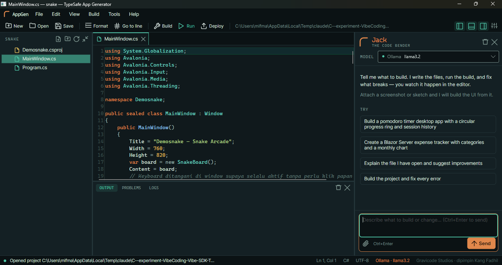
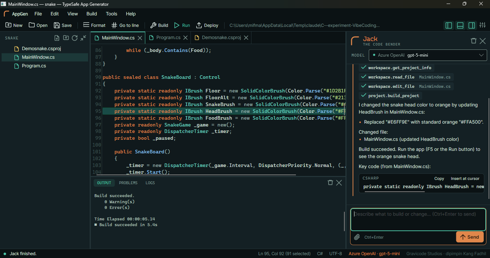
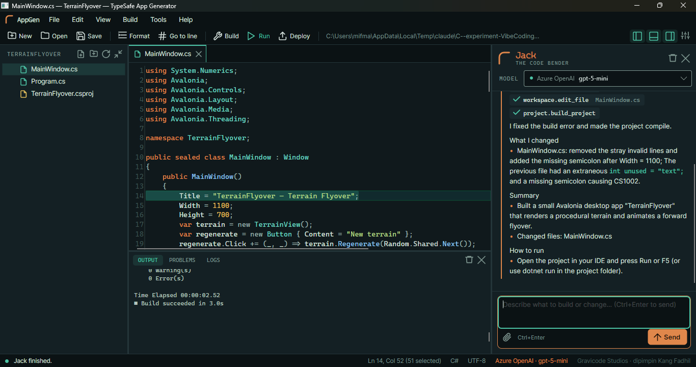
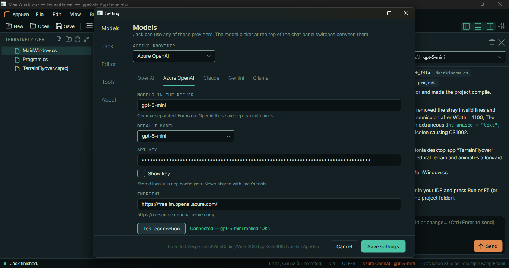
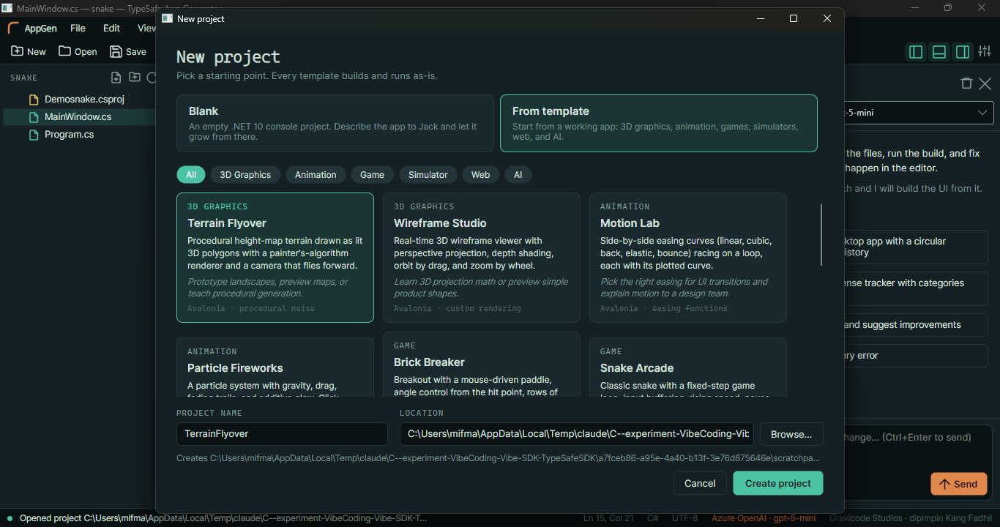
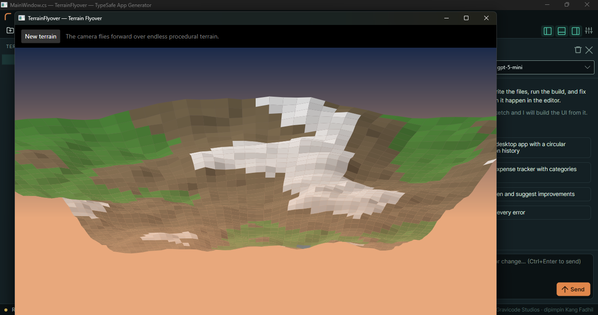
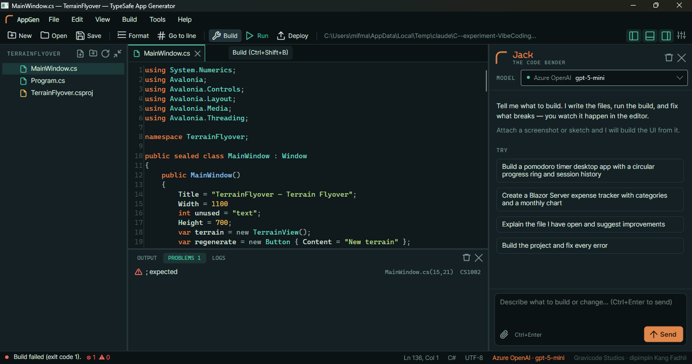

# TypeSafe App Generator

[Bahasa Indonesia](app-generator.id.md) · **English**

An Avalonia desktop code editor with the AI assistant **Jack — The Code Bender**. You describe the app you want. Jack writes the files into the open project, runs `dotnet build`, reads the errors, and fixes them until the build succeeds. Every file Jack touches opens in the editor.



## Running it

```bash
dotnet run --project TypeSafeAppGen
```

The app starts maximized and reopens the last project. With no project open, the editor area shows a start page with New/Open actions, recent projects, and the keyboard shortcuts.

## Layout

| Area | Contents |
| --- | --- |
| Menu & toolbar | New Project, Open Folder/File, Save, Format Code, Go to Line, Build, Run, Stop, Deploy, Settings, plus show/hide toggles for the Explorer, Output panel, and Jack panel |
| Explorer (left) | A VS Code-style file tree. Folders load when you expand them, and `bin`/`obj`/`.git` are hidden. Right-click for New File, New Folder, Rename, Delete, Copy Path, Reveal in File Explorer, and Ask Jack About This File. It refreshes when files change on disk |
| Editor (centre) | Tabbed AvaloniaEdit with TextMate syntax highlighting (the "Patina" theme), line numbers you can show or hide, Find/Replace, per-tab undo, word wrap, and zoom. Tabs with unsaved changes show a dot. Files changed outside the editor, for example by Jack, reload automatically |
| Bottom panel | **Output** (streamed `dotnet build/run/publish`), **Problems** (parsed errors and warnings; double-click to jump to the line), and **Logs** (app activity and every Jack tool call) |
| Jack panel (right) | Model picker at the top, chat thread, image attachments, Clear thread, and Send/Stop. Drag the splitter to resize it; the width is saved |
| Status bar | Process state, error and warning counts, Ln/Col, file language, active model, and Gravicode Studios attribution |

## Jack — The Code Bender



- Send with **Ctrl+Enter** or the Send button. While Jack works, the button becomes **Stop**.
- **Ctrl+L** focuses Jack's input. **Ctrl+I** asks Jack to explain the open file.
- Attach images (PNG, JPG, GIF, or WebP, up to 5 MB) with the paperclip or by dropping files on the panel. Jack can build a UI from a screenshot or sketch.
- Each tool call shows as a copper chip inside the reply (for example `workspace.edit_file MainWindow.cs`). The chip turns into a check mark or a warning when the call finishes.
- Code blocks in a reply have **Copy** and **Insert at cursor** buttons.
- **Clear thread** forgets the conversation. Files Jack already wrote stay as they are.

Jack works in a loop: inspect the project, write files, build, then fix the errors. In a real test with `gpt-5-mini`, asked to "Build the project and fix every error", Jack read error CS1002, edited the file, and rebuilt until the build succeeded.



### Kernel functions

Every function is built with Semantic Kernel and exposed to the model as a tool. File access is confined to the project folder, so relative or absolute paths that escape it are rejected.

| Plugin | Functions |
| --- | --- |
| `workspace` | `get_project_info`, `list_files`, `read_file` (line-numbered, optional range), `write_file`, `edit_file` (replaces a unique snippet; tolerates either line ending), `create_folder`, `delete_path`, `search_in_files` (regex), `get_active_editor`, `open_in_editor` |
| `project` | `build_project` (returns every error with its file and line), `run_tests`, `add_nuget_package`, `dotnet_new` (allow-listed built-in templates only), `list_templates`, `create_project_from_template` |
| `web` | `search_internet` (Tavily), `scrape_web_page` (readable text with scripts and markup removed) |
| `math` | `calculate` (its own expression parser, no dynamic eval), `statistics` |
| `time` | `get_date_time` (IANA or Windows time zones), `date_difference` (including business days), `add_to_date` |
| `typesafe` | `typesafe_sdk_reference` (correct SDK usage), `typesafe_classify` (offline classification with the simulator) |

An exception inside a tool goes back to the model as an `Error: …` result, so Jack can adjust its next step instead of failing the whole turn. Tool rounds per message are capped (24 by default) to keep time and cost bounded.

## LLM providers

| Provider | Connector | Notes |
| --- | --- | --- |
| OpenAI | Semantic Kernel OpenAI | The endpoint can point at any OpenAI-compatible service (DeepSeek, Groq, LM Studio) |
| Azure OpenAI | Semantic Kernel Azure OpenAI | Model = deployment name |
| Claude | Official `Anthropic` SDK via `IChatClient` → `AsChatCompletionService()` | Defaults to `claude-opus-5` |
| Gemini | Semantic Kernel Google | Google AI Studio key |
| Ollama | Semantic Kernel Ollama | Local; no API key |

Reasoning models (OpenAI gpt-5 and the o-series, Claude 4.7 and later) reject the `temperature` parameter, so it is not sent to them.

Provider failures are turned into messages that say what to do, such as "Claude rejected the API key (401). Check it in Settings → Models." or "Could not reach Ollama at http://localhost:11434. Start it with `ollama serve`…". When the fix is a setting, the message comes with an **Open settings** button.

## Configuration

Every setting lives in `app.config.json` in the app folder and can be changed under **Tools › Settings** (Ctrl+,):



- **Models**: the active provider, and for each provider the models listed in the picker, the default model, the API key, and the endpoint. **Test connection** sends one short request.
- **Jack**: temperature, max output tokens, max tool rounds, and the system prompt, with a button to restore the default.
- **Editor**: font size, line numbers, word wrap, and auto save.
- **Tools**: a Tavily API key for internet search, and the default folder for new projects.

Panel sizes, panel visibility, and recent projects are saved too. The old flat format (top-level `Provider`, `Model`, `ApiKey`, `Endpoint`) is migrated automatically. If the file is corrupt, the app saves a `.bak` copy and starts with defaults.

> API keys are stored as plain text in `app.config.json` in the build output folder. The checked-in source file never contains keys.

## New project: Blank or From Template



**Blank** creates an empty .NET 10 console project to grow with Jack. **From template** gives you an app that builds and runs as-is:

| Category | Template | Use case |
| --- | --- | --- |
| 3D Graphics | Wireframe Studio | 3D wireframe viewer with perspective projection, orbit, and zoom |
| 3D Graphics | Terrain Flyover | Procedural terrain with a painter's-algorithm renderer and a flying camera |
| Animation | Particle Fireworks | Particle system with gravity, drag, and trails |
| Animation | Motion Lab | Easing curves compared side by side for UI motion design |
| Game | Snake Arcade | Game loop, input buffering, and high score |
| Game | Brick Breaker | Breakout with angle control from where the ball hits the paddle |
| Simulator | Life Automaton | Game of Life with cell painting and a speed control |
| Simulator | Orbit Sandbox | N-body gravity with a velocity-Verlet integrator |
| Simulator | Outbreak Simulator | Agent-based SIR epidemic with a live chart |
| Web | Live Ops Dashboard | Blazor Server with a background metrics feed and a sparkline |
| Web | Task Board API | Minimal API with typed results, validation, OpenAPI, and a `.http` file |
| AI | Ticket Triage (TypeSafe) | Console ticket routing with `Gravicode.TypeSafeSdk`; runs offline on the simulator |

Templates live in `TypeSafeAppGen/Templates/<id>/`, with a `.txt` suffix so that AppGen does not compile them. `template.json` holds the metadata. The `__ProjectName__` placeholder is replaced with the project name converted to a C# identifier. To add a template, add a folder.



## Build, Run, Deploy

- **Build** (Ctrl+Shift+B) runs `dotnet build` on the root `.slnx`/`.sln`, or on the shallowest `.csproj`.
- **Run** (F5) runs `dotnet run` on the first Exe, WinExe, or Web project. **Stop** (Shift+F5) ends the whole process tree.
- **Deploy** runs `dotnet publish -c Release`. You choose the target (framework-dependent, Windows, Linux, or macOS), whether it is self-contained or a single file, and the output folder.
- Unsaved files are saved before every build. If the app is running when Jack asks for a build, the app is stopped first, because a locked exe makes the build fail.
- Output is streamed in batches and its size is capped, so long builds stay light.



## Shortcuts

| Keys | Action |
| --- | --- |
| Ctrl+L / Ctrl+Enter | Focus Jack / send |
| Ctrl+I | Ask Jack about this file |
| Ctrl+Shift+N / Ctrl+N | New project / new file |
| Ctrl+K / Ctrl+O | Open folder / file |
| Ctrl+S / Ctrl+Shift+S | Save / save all |
| Ctrl+W, Ctrl+Tab | Close tab, switch tab |
| Ctrl+G | Go to line (`42` or `42:8`) |
| Ctrl+F | Find/Replace |
| Shift+Alt+F | Format code (C# via Roslyn, JSON, XML/XAML/csproj) |
| Ctrl+Shift+B, F5, Shift+F5 | Build, Run, Stop |
| Ctrl+B, Ctrl+J, Ctrl+Alt+B | Toggle Explorer, Output panel, Jack panel |
| Alt+Z, Ctrl+= / Ctrl+- | Word wrap, zoom |

## Code layout

```text
TypeSafeAppGen/
  Config/AppConfig.cs        settings + app.config.json migration
  Ai/JackAgent.cs            chat thread, streaming, tool filters, error messages
  Ai/LlmFactory.cs           per-provider connectors and execution settings
  Ai/Plugins/                kernel functions (workspace, project, web, math, time, typesafe)
  Workspace/                 path guard, process runner, diagnostic parser, formatter, templates
  Editor/                    editor tabs, TextMate grammars, Patina theme
  Views/                     MainWindow (partials: Project, Build, Jack, Start) and dialogs
  Templates/                 12 templates + _base skeletons
```

The non-UI logic is tested in `TypeSafeAppGen.Tests` (77 offline tests). The tests cover the path guard, the diagnostic parser, the expression evaluator, the formatter, config migration, scaffolding of every template, and the kernel functions against a fake host.

Made by **Gravicode Studios**, led by Kang Fadhil.
