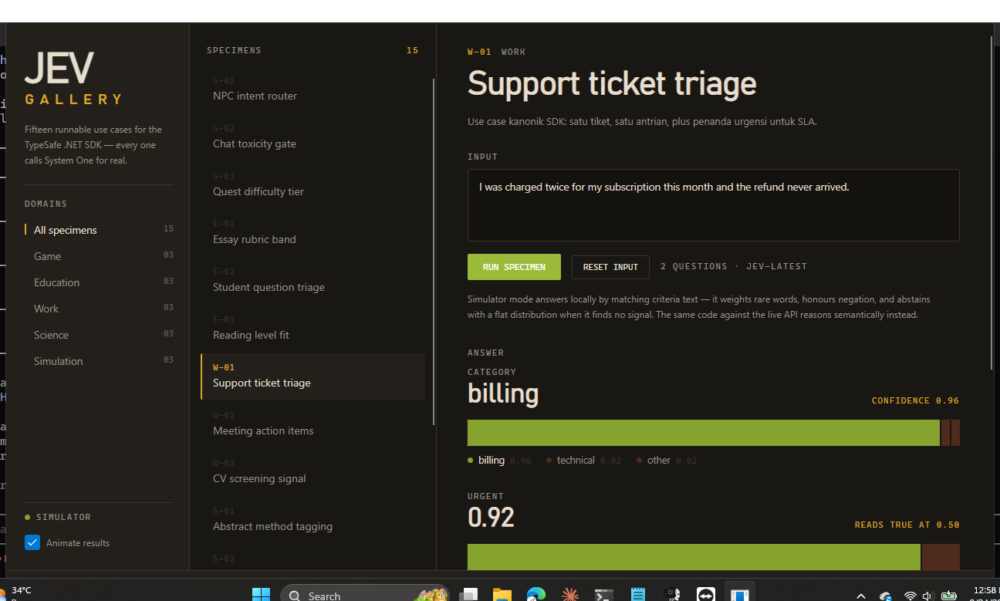
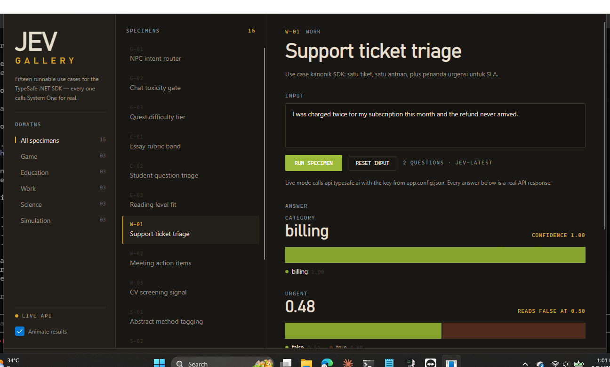

# Jev Gallery

[Bahasa Indonesia](jev-gallery.id.md) · **English**

An Avalonia desktop catalogue of fifteen runnable TypeSafe use cases. Every specimen calls `SystemOneAsync` for real — against the local simulator by default, or against `api.typesafe.ai` when you supply a key — and shows the answer together with its probability distribution and the exact C# that produced it.



## Run it

```bash
dotnet run --project TypeSafe.JevGallery
```

The window has three panes: a domain rail on the left, the specimen catalogue in the middle, and the detail pane on the right where you edit the input, run the specimen, and read the code.

## The catalogue

Specimens carry an accession number — a domain letter and an index — so they can be referred to unambiguously.

| # | Specimen | Questions | What it demonstrates |
| --- | --- | --- | --- |
| G-01 | NPC intent router | choice | Rich `criteria` descriptions sharpen a choice far more than bare labels |
| G-02 | Chat toxicity gate | noul | A 0..1 value lets each server pick its own threshold |
| G-03 | Quest difficulty tier | score | An expected value on an ordered scale, usable directly as a number |
| E-01 | Essay rubric band | score ×2, noul | Several independent judgements in one request |
| E-02 | Student question triage | choice, noul | Routing plus a priority signal |
| E-03 | Reading level fit | score, noul | Grading a passage against a target audience |
| W-01 | Support ticket triage | choice, noul | The canonical use case, plus `RequestId` for observability |
| W-02 | Meeting action items | noul ×2 | Detecting a commitment and whether an owner is named |
| W-03 | CV screening signal | score, choice | A deliberately ambiguous CV — watch the low confidence on `fit` |
| S-01 | Abstract method tagging | choice, noul | Building a searchable literature index |
| S-02 | Field observation coding | choice, score | Turning free-form field notes into aggregable codes |
| S-03 | Anomaly severity | score, noul | Severity and a separate "wake someone" decision |
| M-01 | Legal move selection | choice | Only legal moves become criteria, so an illegal answer cannot exist |
| M-02 | Traffic incident dispatch | choice, noul | Probabilities expose multi-unit incidents a single label would hide |
| M-03 | Sensor state machine | choice, noul | Telemetry vocabulary in the criteria descriptions |

## Reading the distribution strip

Every answer is drawn as a horizontal band whose segment widths are the probability mass across the criteria. The chosen segment is moss green, the rest are muted rust. This is the point of the gallery: TypeSafe does not return a bare label, it returns a distribution, and an ambiguous case is visible at a glance rather than hidden behind a single word.

- **A choice** shows one segment per label, plus the confidence.
- **A noul** shows the 0..1 value split into true and false, and whether it reads true at the 0.50 threshold.
- **A score** shows one segment per level, the expected value, and the nearest legend label.

W-03 and M-01 are the ones to look at: both answer with low confidence on purpose, and the sample code for W-03 shows how to route a low-confidence decline to a human instead of acting on it.

## Simulator mode versus live mode

`app.config.json` next to the executable controls the mode.

```json
{
  "ApiKey": "",
  "Endpoint": "https://api.typesafe.ai",
  "DefaultModel": "jev-latest",
  "UseSimulator": true,
  "Motion": true
}
```

**Simulator mode** (the default) answers locally with no key and no network. It is lexical, not semantic: it weights rare words in the criteria above common ones, honours negation, and abstains with a flat distribution when it finds no signal rather than guessing. It is good enough to show the shape of an answer, and it is what the regression tests run against.

**Live mode** — set `UseSimulator` to `false` — calls the real API. The key is never stored in the repository: the gallery looks at `ApiKey` in the config, then `TYPESAFE_API_KEY`, then the file named by `TYPESAFE_API_KEY_FILE`.

```powershell
$env:TYPESAFE_API_KEY_FILE = 'C:\secrets\TypeSafeApiKey.txt'
dotnet run --project TypeSafe.JevGallery
```



The rail shows `LIVE API` in brass when the gallery is talking to the real endpoint. The difference is worth seeing: on G-03 the simulator lands on `steady` while the live model returns `2.18 — demanding`.

## Design notes

The palette is warm instrument casing rather than the usual dark-blue dashboard: bark `#191714`, bone `#E6DFCE`, moss `#86A22F` for the chosen answer, rust `#B4522E` for the residual probability, and brass `#D9A62B` used once, for the active marker. Display type is Bahnschrift, body is Segoe UI, and every structural label and number is set in Cascadia Mono. The one animated moment is the distribution strip wiping open when a specimen runs; it can be turned off with the **Animate results** toggle.

## Tests

The catalogue is not just text. `TypeSafeSdk.Tests/GalleryCatalogTests.cs` links `Specimens.cs` directly and runs every specimen through the SDK, asserting that each one answers all of its questions, that a choice answer is always a label from its own criteria, and that the demo answers for G-01, E-02, W-01, S-01, S-02, and M-03 stay correct.

```bash
dotnet test TypeSafeSdk.Tests/TypeSafeSdk.Tests.csproj --filter "FullyQualifiedName~GalleryCatalogTests"
```

Created by **Gravicode Studios**, led by Kang Fadhil.
